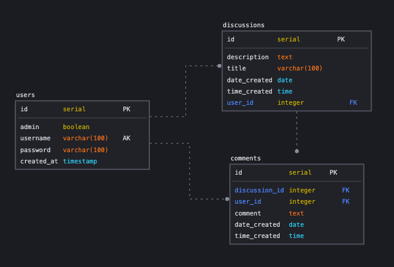

# Plantasia

Plantasia is a message board application for people who love plants. A signed-in user can start a discussion about any plant topic they desire, and the community can chime in with their thoughts. For example, a discussion could be asking for advice on growing a certain plant, giving advice about plant parenting, or sharing anecdotal information about something plant related. Each discussion contains comments relevant to the particular discussion. Users can edit and delete their discussions and comments, but only an admin can delete other users discussions and comments. Built with Ruby, Sinatra, and CSS.

---

## Installation

- Unzip the application.
- Make sure you have bundler installed. Check [configuration](#configuration) to see the bundler version used.
- Ensure you are using the appropriate Ruby version. Check [configuration](#configuration) to see the Ruby version used.
- Run `bundle install` to create `Gemfile.lock`.
- Setup the database by running the following command in your terminal from the root directory:

```bash
bash db_restore.sh plantasia
```

- This script will automatically start up the server, so once the script is done, you can view Plantasia by clicking here or pasting this into your browser: http://127.0.0.1:4567
- To stop the server, press: `command + c`
- To start the server, enter this command from the root directory: `bundle exec ruby plantasia.rb`

The script being run by this command can be found [here](./db_restore.sh).

---

## Configuration

- Ruby Version: **2.7.0**
- Tested on Chrome Version: **103.0.5060.134**
- PostgreSQL Version: **14.2**
- Bundler Version: **2.3.18**

---

## Usage

- When first entering Plantasia, you'll be prompted to go to the discussion board or sign in/sign up. After that, you'll be allowed to view the discussions and all existing comments, but you will need to be logged in to create a discussion or comment on a thread.
- At any point, you can click on `Plantasia` at the top of the page to be directed to the most recent discussions.
- To view the comments of a discussion, click on the discussion's title.
- You can sign up by entering a unique username and a password, or you can sign in as an existing user using the credentials below (note: the first user is the only admin in the system):

| username | password | admin status |
|---|---|---|
| Plant_Admin | 12345 | admin |
| tsabati1 | 54321 | non-admin |
| pedgeson2 | 54321 | non-admin |
| drenison3 | 54321 | non-admin |

Notes on user permissions:

- All users can edit and delete their discussions and comments.
- Admins can edit their discussions and comments and delete any user's discussions and comments.
- When signed in, an _edit_ and _delete_ button will appear on any discussion or comment that the signed-in user has permission to edit or delete.
- Currently, only the user `Plant_Admin` has **admin** privileges.

---

## Schema

Entity Relationship Diagram for the Plantasia database:



- You can find the create statements for the database tables in [schema.sql file](/schema.sql).
- You can find the seed data for this application in the [seed_data.sql file](/seed_data.sql).

---

## File System

The file system used is the same as the projects for RB175 and RB185, except for the `code` directory. I utilized this folder to separate:

- The `DatabasePersistence` class that handles all database queries.
  - [database_persistence.rb](/code/database_persistence.rb)
- The helper methods that are utilized in my implementation of pagination, stored in a module.
  - [pagination_util.rb](/code/pagination_util.rb)
- A module used to store different limits for my pagination implementation.
  - [limit.rb](/code/limit.rb)
- The general purpose helper methods used in the application, stored in a module.
  - [application_util.rb](/code/application_util.rb)
- All error handling/validation methods.
  - [error_handling_and_validation.rb](/code/error_handling_and_validation.rb)

---

## Application-Specific Requirements

I've included additional commentary for the application-specific requirements that I thought could benefit from further explanation. However, some requirements seem self-explanatory for someone utilizing the application, so I've excluded them from this section.

> The application must use at least two kinds of related data where one of the data types is a collection of objects of the other type. 

See the [ERD](#schema) above for an overview of the relations utilized in Plantasia's database and the [schema.sql file](/schema.sql) for the details of these relations.

This applications database consists of:

- A one-to-many relationship between `users` (one) and `discussions` (many).
- A one-to-many relationship between `discussions` (one) and `comments` (many).
- A one-to-many relationship between `users` (one) and `comments` (many).

> The application must provide CRUD capabilities (create-read-update-delete).

Here are specific examples of CRUD capabilities utilized within this application:

- **Create** - is demonstrated within the route that enables HTTP **post** requests to create a new comment, defined on line 268 of the [plantasia.rb file](/plantasia.rb). Within that route the `DatabasePersistence#create_comment` method is invoked, found on line 216 of the [database_persistence.rb file](/code/database_persistence.rb), which inserts a new row into the `comments` table.
- **Read** - is demonstrated within the route that enables HTTP **get** requests to display discussion comments, defined on line 244 of the [plantasia.rb file](/plantasia.rb). Within that route the `DatabasePersistence#fetch_comments` method is invoked, found on line 155 of the [database_persistence.rb file](/code/database_persistence.rb), which fetches the appropriate comments for a particular discussion.
- **Update** - is demonstrated within the route that enables HTTP **post** requests to update comments, defined on line 340 of the [plantasia.rb file](/plantasia.rb). Within that route the `DatabasePersistence#update_comment` method is invoked, found on line 193 of the [database_persistence.rb file](/code/database_persistence.rb), which updates the appropriate comment of a specific discussion.
- **Destroy** - is demonstrated within the route that enables HTTP **post** requests to destroy comments, defined on line 286 of the [plantasia.rb file](/plantasia.rb). Within that route the `DatabasePersistence#delete_comment` method is invoked, found on line 255 of the [database_persistence.rb file](/code/database_persistence.rb), which destroys the appropriate comment of a specific discussion.

When exploring the application, keep in mind that users can only edit and delete discussions and comments they have authored. While, admin's can edit/delete their own discussions/comments, **and** delete other users discussions/comments.

> The page used to update a collection or object must have a unique URL.

The route responsible for displaying the update page for a particular comment can be found on line 311 of the [plantasia.rb file](/plantasia.rb). The route responsible for posting this update to the database can be found on line 340 of the same file. Within this second route the `DatabasePersistence#update_comment` method is invoked, found on line 193 of the [database_persistence.rb file](/code/database_persistence.rb), which updates the appropriate comment on a specific discussion.

> When listing collections and objects, limit the amount of output per page to a maximum item count (say, 5 or 10 items per page). If there are more than this number of items, the user should be able to scroll through the data in chunks of the maximum item count. This process is called pagination.

I've limited the number of **discussions** per page to 6 and the number of **comments** per page to 10. At the bottom of any discussion/comment list is an index of the different pages you can look through. You can click on a specific page number or use the arrow keys on either end of the page index. A page number or arrow will be un-clickable if you are currently on that page. Additionally, I've limited the number of visible page indices to five at a time.

The majority of the logic required to implement pagination can be found in the [pagination_util.rb file](/code/pagination_util.rb).

The `DatabasePersistence#fetch_comments` method, defined on line 155 of the [database_persistence.rb file](/code/database_persistence.rb), is the query responsible for fetching the appropriate comments, in the correct order, in the correct sized batches.

Additionally, the logic within the [limit.rb file](/code/limit.rb) is utilized to set limits specific to the pagination implementation.

Lines 49-83 of the [discussions.erb file](/views/discussions.erb) demonstrates the logic for visually displaying my implementation of pagination.

> ...your project should validate the page number and issue an appropriate error message if the URL is given with an invalid page number.

This can be verified by attempting to enter invalid page numbers in the URL or by inspecting the routes located in the [plantasia.rb file](/plantasia.rb). Specific error handling logic can be found in the [error_handling_and_validation.rb file](/code/error_handling_and_validation.rb).

> When listing collections or objects, sort the items consistently. For instance: alphabetically, numerically, by date, and so on.

I've ordered all discussions and comments by date and time, starting with the most recent.

The `DatabasePersistence#fetch_comments` method, defined on line 155 of the [database_persistence.rb file](/code/database_persistence.rb), demonstrates the query responsible for fetching the appropriate comments in the correct order.

---

Thank you for taking the time to look at Plantasia! I hope you enjoyed it! :)
# plantasia
